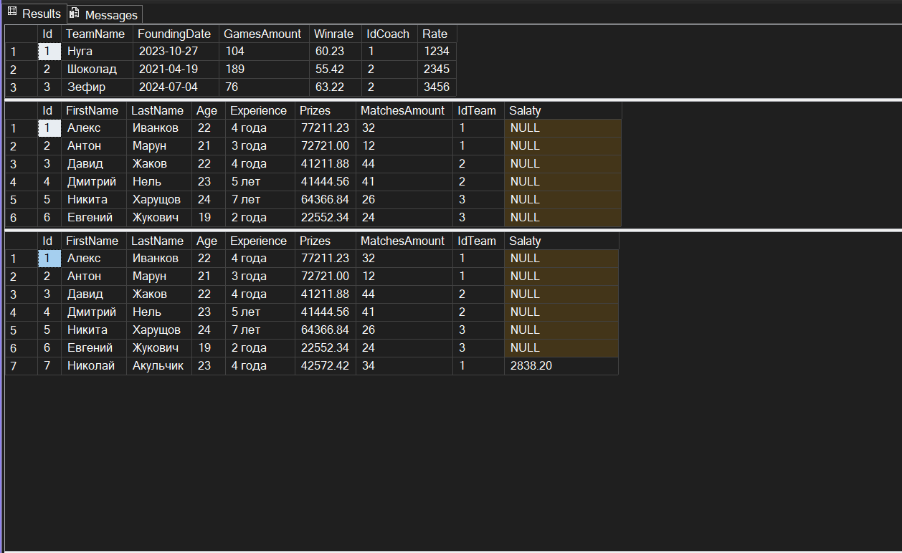
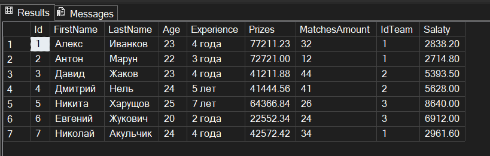
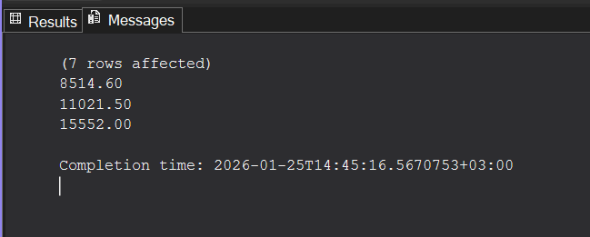
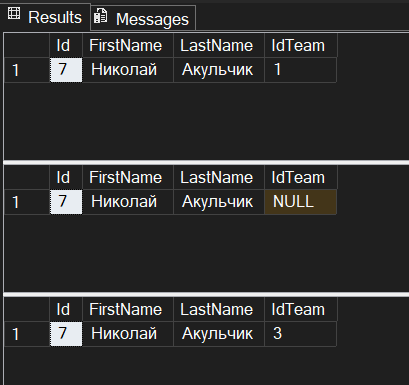
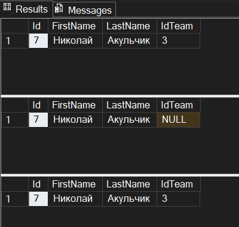

# TMS Lesson 21 - Homework

---

### Основы баз данных

---

Установить MySQL, Microsoft SQL Server management Studio, создать базу данных с 3мя таблицами – Игрок, комманда, тренер.  
Игрок может принадлежать одной комманде, в комманде может быть много игроков и один тренер.  
Один тренер может тренировать много комманд.  
Добавить проверку на имя (не менее 2, не более 10), добавить уникальный ключ для 2х колонок (имя, фамилия).

---

### Компоненты БД

---

Добавить в базу данных триггер, который срабатывает на добавление игрока в таблицу.  
Добавить колонки Team.Rate, Player.Age, Player.Salary. Триггер считает зарплату исходя из Rate команды, умноженное на Age/10.  

#### Задание повышенной сложности

Создать хранимую процедуру, которая считает количество денег, которая команда тратит на игроков.  
Через транзакцию совершить «Трансфер игрока в другую команду через свободный рынок». Необходимо удалить игрока из команды, затем добавить в новую. Проверить функции Commit, RollBack.  

---

##### Работа триггера

##### Работа процедуры

##### Работа транзакции

###### Успешная транзакция

###### Неудачная транзакция и откат

