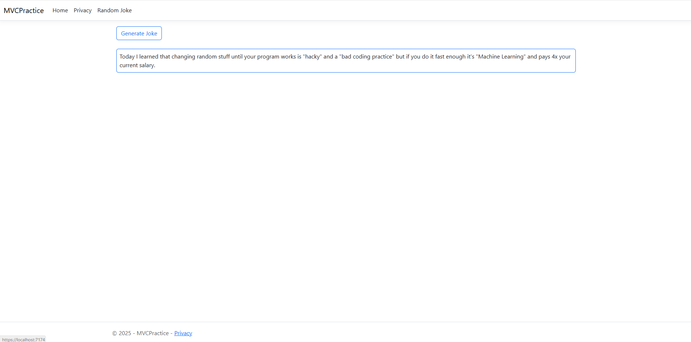

# TMS Lesson 15 - Homework

---

### Основы ASP.NET

---

Нужно создать mvc проект в свой солюшен (не нужно создавать новый репозиторий ).  
В целом посмотреть из чего он состоит.  
Cоединить свой контроллер с вьюшкой. Только версию последнюю сразу использовать.
