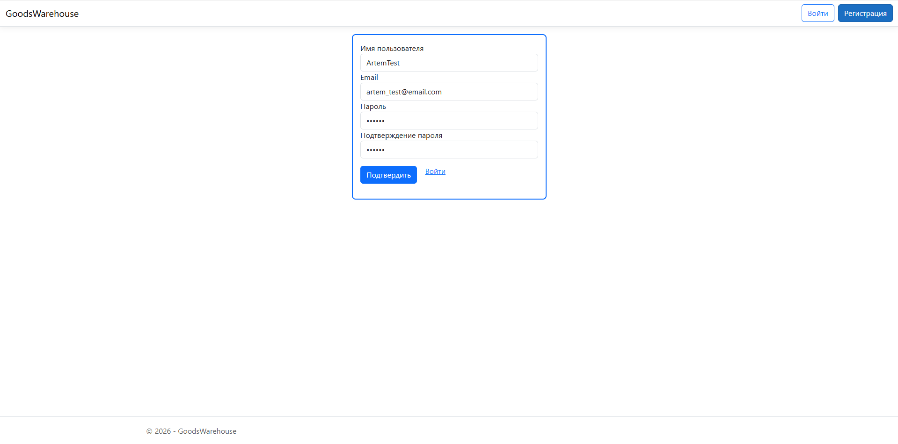
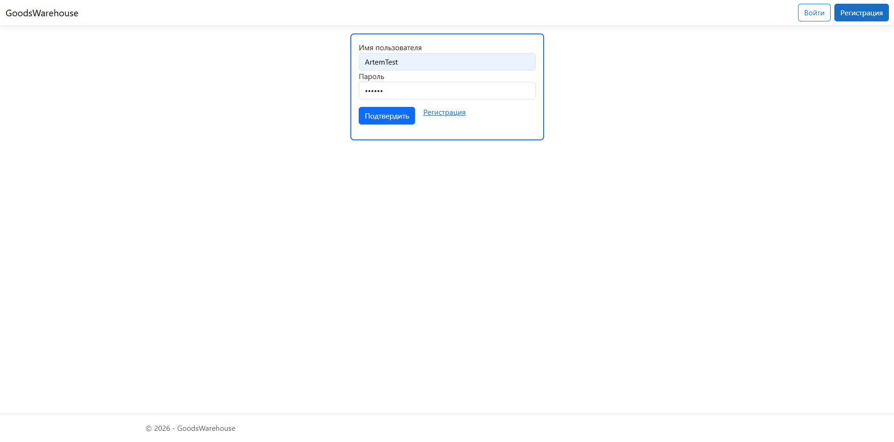

# TMS Lesson 16-18 - Homework

---

### Lesson 16: Контроллеры

---

На основе приложения инвентарь создать ASP.NET core web api приложение с контроллером, которое умеет добавлять продукт на склад, забирать список продуктов с класса, модифицировать продукт соглано предоставленным данным.  
Создать второй контроллер, который умеет считать сумму всех товаров на складе, сумму товаров по категориям.  

---

### Lesson 17: Модели и представления

---

Добавить представление инвентаря в проект предыдущего задания.  
Уметь выводить в представление все результаты предоставленных контроллеров.  

---

### Lesson 18: Жизненный цикл запроса в ASP.Net Core

---

Добавить в проект предыдущего занятия Middleware для обработки исключений.  
Добавить фильтр, который устанавливает время запроса в Header ответа.

Добавить Basic аутентификацию.

---

### Результат

---

##### Регистрация

---

##### Вход

---

##### Результат

