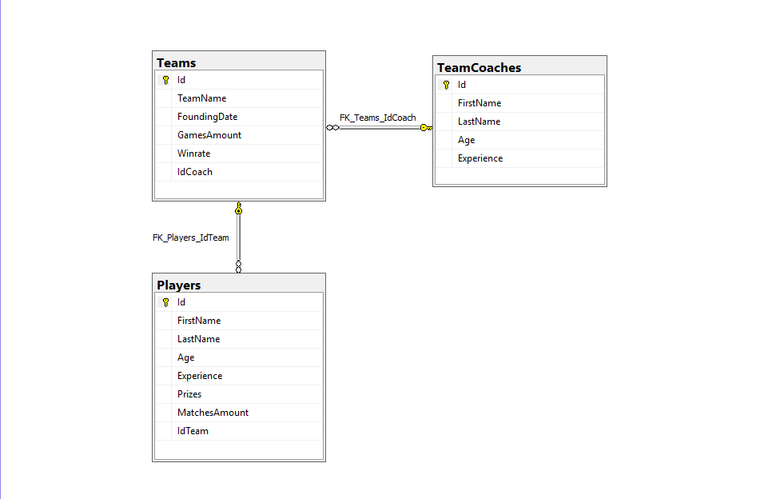

# TMS Lesson 19 - Homework

---

### Основы баз данных

---

Установить MySQL, Microsoft SQL Server management Studio, создать базу данных с 3мя таблицами – Игрок, комманда, тренер.  
Игрок может принадлежать одной комманде, в комманде может быть много игроков и один тренер.  
Один тренер может тренировать много комманд.  
Добавить проверку на имя (не менее 2, не более 10), добавить уникальный ключ для 2х колонок (имя, фамилия).

