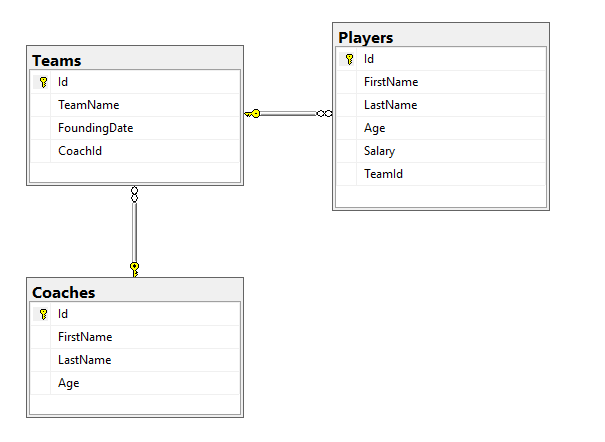
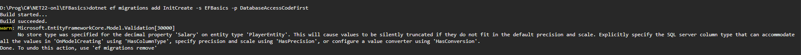

# TMS Lesson 23 - Homework

---

### Основы ORM – Entity framework

---

Создать простое ASP.NET приложение, установить Microsoft Entity Framework и создать базу данных с помощью Code-First подхода.

#### Задание повышенной сложности:  
Создать приложение, с использованием DataBase-First подхода

Команда для создания с использованием DataBase-First подхода:
    `dotnet ef dbcontext scaffold "Data Source=(localdb)\MSSQLLocalDB;Database=DatabaseCodeFirst;Persist Security Info=True;User ID=artem;Password=artem1234;Pooling=False;MultipleActiveResultSets=False;Encrypt=True;TrustServerCertificate=False;Application Name=\"SQL Server Management Studio\";Command Timeout=0" Microsoft.EntityFrameworkCore.SqlServer -p DatabaseAccessDBFirst -c PlayerTeamDBFirstDBContext --context-dir . -o Models`