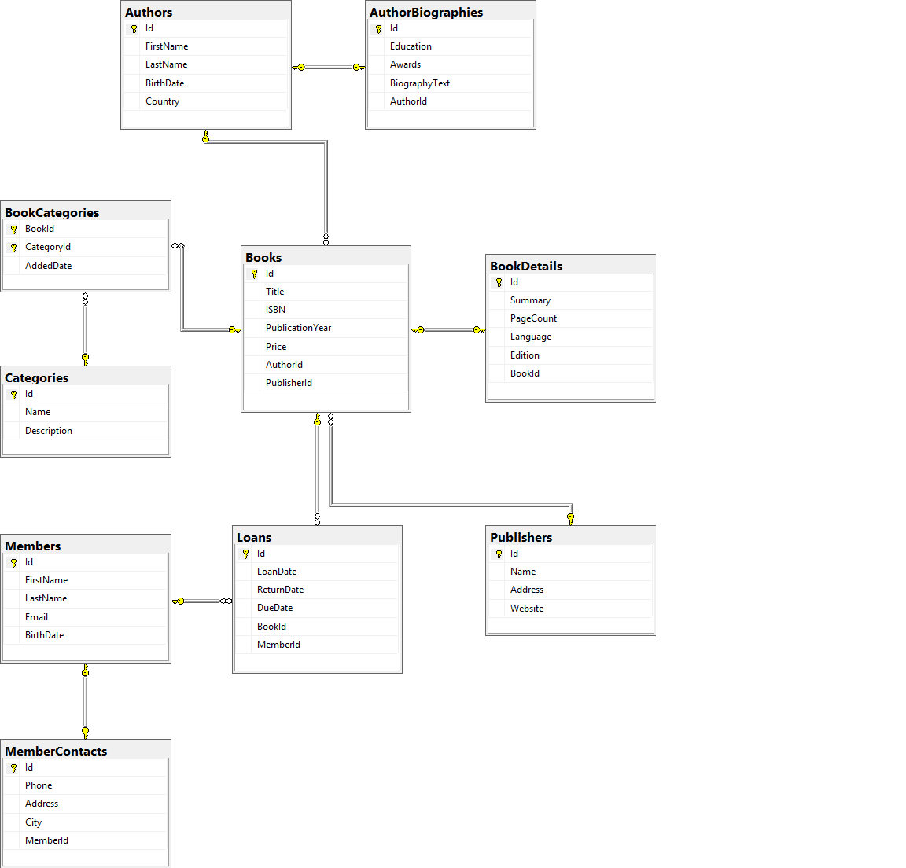

# TMS Lesson 24 - Homework

---

### Основные компоненты Entity Framework

---

Создать простое ASP.NET приложение, установить Microsoft Entity Framework и создать базу данных с помощью Code-First подхода, настроить связи между таблицами и сделать миграцию.

Требования к сущностям:

1. Book (Книга)
   - Поля: Id, Title, ISBN, PublicationYear, Price, AuthorId (внешний ключ), PublisherId (внешний ключ, nullable)
   - Связи:
     - С Author: один автор - много книг (обязательная связь, каскадное удаление)
     - С Publisher: один издатель - много книг (необязательная связь, ограничение на удаление Restrict)
     - С Category: многие ко многим через промежуточную таблицу BookCategory
     - С BookDetail: один к одному (обязательная связь, каскадное удаление)
     - С Loan: одна книга - много выдач

2. Author (Автор)
   - Поля: Id, FirstName, LastName, BirthDate, Country
   - Связи:
     - С Book: один автор - много книг
     - С AuthorBiography: один к одному (обязательная связь, каскадное удаление)

3. Category (Категория)
   - Поля: Id, Name, Description
   - Связь: с Book через BookCategory (многие ко многим)

4. Publisher (Издатель)
   - Поля: Id, Name, Address, Website
   - Связь: с Book (один издатель - много книг)

5. Member (Член библиотеки)
   - Поля: Id, FirstName, LastName, Email, MembershipDate
   - Связь:
     - С Loan: один член - много выдач
     - С MemberContact: один к одному (обязательная связь, каскадное удаление)

6. Loan (Выдача)
   - Поля: Id, LoanDate, ReturnDate (nullable), DueDate, BookId (внешний ключ), MemberId (внешний ключ)
   - Связь:
     - С Book: одна книга - много выдач (обязательная связь)
     - С Member: один член - много выдач (обязательная связь)

7. BookDetail (Детали книги)
   - Поля: Id, Summary, PageCount, Language, Edition, BookId (внешний ключ)
   - Связь: с Book (один к одному)

8. AuthorBiography (Биография автора)
   - Поля: Id, Education, Awards, BiographyText, AuthorId (внешний ключ)
   - Связь: с Author (один к одному)

9. MemberContact (Контактная информация члена)
   - Поля: Id, Phone, Address, City, MemberId (внешний ключ)
   - Связь: с Member (один к одному)

10. BookCategory (Промежуточная таблица)
    - Поля: BookId (внешний ключ), CategoryId (внешний ключ), AddedDate
    - Связь: с Book и Category (многие ко многим)

Ограничения на уровне базы данных:

- Уникальность ISBN для Book.
- Уникальность Email для Member.
- Проверка, что Price ≥ 0.
- Проверка, что PublicationYear между 1900 и текущим годом.
- Проверка, что FirstName и LastName не пустые и не длиннее 100 символов.
- Проверка, что LoanDate <= DueDate.
- Проверка, что если ReturnDate указан, то он >= LoanDate.

---

